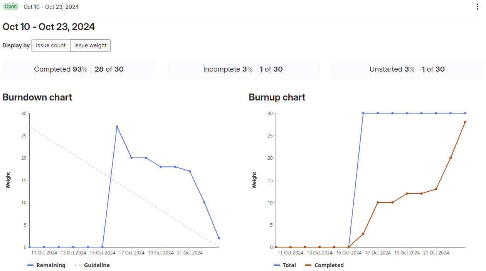

# Sprint 1

## Goals

- Prototypes with two different technologies are implemented and their pros and cons are evaluated
- Tech stack for the project has been chosen
- Licence is defined
- Git repository and documentation skeleton are created

## Review
**Demo:**
- PoC Kotlin and pdflatex: https://gitlab.ti.bfh.ch/decibel-threshold-event-displayer/decibel-threshold-event-displayer/-/issues/16
- PoC SwiftLaTeX: https://gitlab.ti.bfh.ch/decibel-threshold-event-displayer/decibel-threshold-event-displayer/-/issues/9

**Done:**
- [Create backlog](https://gitlab.ti.bfh.ch/decibel-threshold-event-displayer/decibel-threshold-event-displayer/-/issues/5)
- [Kick-Off / Tutor's Welcome :-)](https://gitlab.ti.bfh.ch/decibel-threshold-event-displayer/decibel-threshold-event-displayer/-/issues/3)
- [Prepare documentation](https://gitlab.ti.bfh.ch/decibel-threshold-event-displayer/decibel-threshold-event-displayer/-/issues/7)
- [Build PoC with Kotlin and pdflatex](https://gitlab.ti.bfh.ch/decibel-threshold-event-displayer/decibel-threshold-event-displayer/-/issues/16)
- [Build PoC with SwiftLaTeX](https://gitlab.ti.bfh.ch/decibel-threshold-event-displayer/decibel-threshold-event-displayer/-/issues/9)
- [Evaluate technology stack](https://gitlab.ti.bfh.ch/decibel-threshold-event-displayer/decibel-threshold-event-displayer/-/issues/8)
- [Get familiar with WAV files](https://gitlab.ti.bfh.ch/decibel-threshold-event-displayer/decibel-threshold-event-displayer/-/issues/27)

**Not done:**
- [Create and init git repository](https://gitlab.ti.bfh.ch/decibel-threshold-event-displayer/decibel-threshold-event-displayer/-/issues/6)
  - The Hello World (Example) program is missing because the stack was just evaluated at the end of the sprint.
- [Define licence](https://gitlab.ti.bfh.ch/decibel-threshold-event-displayer/decibel-threshold-event-displayer/-/issues/19)
  - We are currently not sure if we will need any additional libraries, so it does not make sense to define the license already.

**Goals:**
- [x] Prototypes with two different technologies are implemented and their pros and cons are evaluated
- [x] Tech stack for the project has been chosen
- [ ] Licence is defined
- [ ] Git repository and documentation skeleton are created

[Sprint overview](https://gitlab.ti.bfh.ch/groups/decibel-threshold-event-displayer/-/cadences/56/iterations/715)

## Retro

**What went well:**
- Creation of prototypes
- Working with LaTeX and Markdown for documentation

**Problems:**
- Correct setup of Bibtex for citations
- Gitlab:
    - Merge requests cannot be enabled at the moment
    - The issue board view (Kanban) based on tags is not really usable
- We did not properly plan the first sprint, thus we had make adjustments while the sprint was already running
    - We had to split issues into tasks because multiple people working on the same issue
    - We did not do the planning poker before the sprint and had to weigh the tasks during the sprint
- We underestimated the required time for each package of work
- Understanding of decibel in the context of audio

**Improvements:**
- Properly prepare the sprint with issues, tasks, and planning poker
- More realistically weighing the tasks and issues

# Sprint 2

## Goals
- Intermediate presentation is prepared and presented
- Requirements are specified
- UX-Prototype is defined
- System delimination is specified
- Decibel values can be calculated
- Licence is defined
- Git repository and documentation skeleton are created
