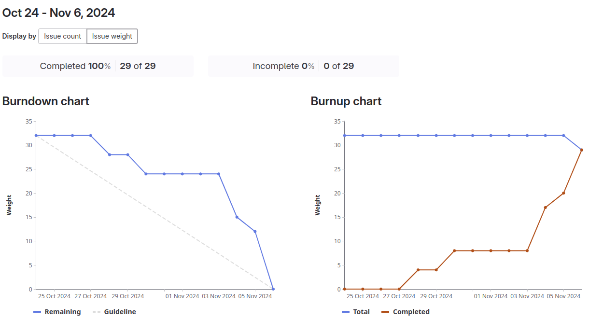

# Sprint 1

## Goals

- Prototypes with two different technologies are implemented and their pros and cons are evaluated
- Tech stack for the project has been chosen
- Licence is defined
- Git repository and documentation skeleton are created

## Review - 23.10.2024
**Demo:**
- PoC Kotlin and pdflatex: https://gitlab.ti.bfh.ch/decibel-threshold-event-displayer/decibel-threshold-event-displayer/-/issues/16
- PoC SwiftLaTeX: https://gitlab.ti.bfh.ch/decibel-threshold-event-displayer/decibel-threshold-event-displayer/-/issues/9

**Done:**
- [Create backlog](https://gitlab.ti.bfh.ch/decibel-threshold-event-displayer/decibel-threshold-event-displayer/-/issues/5)
- [Kick-Off / Tutor's Welcome :-)](https://gitlab.ti.bfh.ch/decibel-threshold-event-displayer/decibel-threshold-event-displayer/-/issues/3)
- [Prepare documentation](https://gitlab.ti.bfh.ch/decibel-threshold-event-displayer/decibel-threshold-event-displayer/-/issues/7)
- [Build PoC with Kotlin and pdflatex](https://gitlab.ti.bfh.ch/decibel-threshold-event-displayer/decibel-threshold-event-displayer/-/issues/16)
- [Build PoC with SwiftLaTeX](https://gitlab.ti.bfh.ch/decibel-threshold-event-displayer/decibel-threshold-event-displayer/-/issues/9)
- [Evaluate technology stack](https://gitlab.ti.bfh.ch/decibel-threshold-event-displayer/decibel-threshold-event-displayer/-/issues/8)
- [Get familiar with WAV files](https://gitlab.ti.bfh.ch/decibel-threshold-event-displayer/decibel-threshold-event-displayer/-/issues/27)

**Not done:**
- [Create and init git repository](https://gitlab.ti.bfh.ch/decibel-threshold-event-displayer/decibel-threshold-event-displayer/-/issues/6)
  - The Hello World (Example) program is missing because the stack was just evaluated at the end of the sprint.
- [Define licence](https://gitlab.ti.bfh.ch/decibel-threshold-event-displayer/decibel-threshold-event-displayer/-/issues/19)
  - We are currently not sure if we will need any additional libraries, so it does not make sense to define the license already.

**Goals:**
- [x] Prototypes with two different technologies are implemented and their pros and cons are evaluated
- [x] Tech stack for the project has been chosen
- [ ] Licence is defined
- [ ] Git repository and documentation skeleton are created

[Sprint overview 1](https://gitlab.ti.bfh.ch/groups/decibel-threshold-event-displayer/-/cadences/56/iterations/715)


## Retro - 23.10.2024

**What went well:**
- Creation of prototypes
- Working with LaTeX and Markdown for documentation

**Problems:**
- Correct setup of Bibtex for citations
- Gitlab:
    - Merge requests cannot be enabled at the moment
    - The issue board view (Kanban) based on tags is not really usable
- We did not properly plan the first sprint, thus we had make adjustments while the sprint was already running
    - We had to split issues into tasks because multiple people working on the same issue
    - We did not do the planning poker before the sprint and had to weigh the tasks during the sprint
- We underestimated the required time for each package of work
- Understanding of decibel in the context of audio

**Improvements:**
- Properly prepare the sprint with issues, tasks, and planning poker
- More realistically weighing the tasks and issues

# Sprint 2

## Goals
- Intermediate presentation is prepared and presented
- Requirements are specified
- UX-Prototype is defined
- System delimination is specified
- Decibel values can be calculated
- Licence is defined
- Git repository and documentation skeleton are created

## Review - 05.11.2024
**Demo:**
- Every team member presented his slides for the intermediate presentation
- Darius: Presented the scrum report
- Lukas: Presented the UX prototypes
- Dominic: Presented how the dB mapping works

**Done:**
- [Write Introduction](https://gitlab.ti.bfh.ch/decibel-threshold-event-displayer/decibel-threshold-event-displayer/-/issues/71)
- [Write specification](https://gitlab.ti.bfh.ch/decibel-threshold-event-displayer/decibel-threshold-event-displayer/-/issues/63)
- [Create a github organization for distributing the application as github pages](https://gitlab.ti.bfh.ch/decibel-threshold-event-displayer/decibel-threshold-event-displayer/-/issues/56)
- [Calculate db(A) from relativ db values](https://gitlab.ti.bfh.ch/decibel-threshold-event-displayer/decibel-threshold-event-displayer/-/issues/55)
- [Prepare intermediate presentation](https://gitlab.ti.bfh.ch/decibel-threshold-event-displayer/decibel-threshold-event-displayer/-/issues/28)
- [Define licence](https://gitlab.ti.bfh.ch/decibel-threshold-event-displayer/decibel-threshold-event-displayer/-/issues/19)
- [Create and init git repository](https://gitlab.ti.bfh.ch/decibel-threshold-event-displayer/decibel-threshold-event-displayer/-/issues/6)
- [Define content](https://gitlab.ti.bfh.ch/decibel-threshold-event-displayer/decibel-threshold-event-displayer/-/issues/21)

**Not done:**
- [Define interface](https://gitlab.ti.bfh.ch/decibel-threshold-event-displayer/decibel-threshold-event-displayer/-/issues/17)
  - Because of the presentation deadline, the documentation of this task was not done yet

**Goals:**
- [x] Intermediate presentation is prepared and presented
- [x] Requirements are specified
- [x] UX-Prototype is defined
- [x] System delimitation is specified
- [x] Decibel values can be calculated
- [x] Licence is defined
- [x] Git repository and documentation skeleton are created

[Sprint overview 2](https://gitlab.ti.bfh.ch/decibel-threshold-event-displayer/decibel-threshold-event-displayer/-/cadences/56/iterations/716)



## Retro - 06.11.2024

**What went well:**
- The presentation was prepared in time, and we are confident that the presentation went well
- We finally know how the dB values actually should be calculated
- Because we specified a lot of things we have now a clear way forward for building the product

**Problems:**
- The criteria for the intermediate presentation were available on a short notice
- Because we focused manly on the presentation, we didn't make a lot of progress on the product itself
- We had some issues with the table of contents in the intermediate presentation, because we used LaTeX

**Improvements:**
- We want to use the GitLab issue board lanes with scoped labels to change the issue priority with drag and drop


# Sprint 3

## Goals
- Write documentation for interface
- Read and parse *.wav files correctly
- Filter audio data correctly
- Enable repository mirroring for distribution
- Implement MVP frontend application

## Review - 20.11.2024
**Demo:**
- Dominic: Presented how he implemented
- Lukas: Presented the mirroring of the repositories from GitLab to GitHub

**Done:**
- [Read WAV file](https://gitlab.ti.bfh.ch/decibel-threshold-event-displayer/decibel-threshold-event-displayer/-/issues/10)
- [Define interface](https://gitlab.ti.bfh.ch/decibel-threshold-event-displayer/decibel-threshold-event-displayer/-/issues/17)
- [Enable repository mirroring](https://gitlab.ti.bfh.ch/decibel-threshold-event-displayer/decibel-threshold-event-displayer/-/issues/76)

**Not done:**
- [Filter data](https://gitlab.ti.bfh.ch/decibel-threshold-event-displayer/decibel-threshold-event-displayer/-/issues/11)
- [Implement frontend application](https://gitlab.ti.bfh.ch/decibel-threshold-event-displayer/decibel-threshold-event-displayer/-/issues/24)

**Goals:**
- [x] Write documentation for interface
- [x] Read and parse *.wav files correctly
- [ ] Filter audio data correctly
- [x] Enable repository mirroring for distribution
- [ ] Implement MVP frontend application

## Retro - 20.11.2024

**What went well:**
- We finally started with the implementation
- We have a rudimentary javascript test environment (not automated yet)
- We know that the automatic mirroring of the repositories is working

**Problems:**
- The special week 3 took our focus entirely (we were in the same team)
- Getting used to writing javascript again
- Mirroring repositories is way harder than we thought

**Improvements:**
- Getting our focus back to project 1

# Sprint 4

## Goals
- Filter audio data correctly
- Implement MVP frontend application
- Improve javascript test environment

## Review - 08.12.2924
**Demo:**
- Darius: Presented the frontend application
- Dominic: Presented the JavaScript test framework
- Lukas: Presented where and why he got stuck in the [Filter data](https://gitlab.ti.bfh.ch/decibel-threshold-event-displayer/decibel-threshold-event-displayer/-/issues/11) task

**Done:**
- [Implement frontend application](https://gitlab.ti.bfh.ch/decibel-threshold-event-displayer/decibel-threshold-event-displayer/-/issues/24)
- [Configure GitHub Pages to display the app as index](https://gitlab.ti.bfh.ch/decibel-threshold-event-displayer/decibel-threshold-event-displayer/-/issues/94)
- [Read WAV file](https://gitlab.ti.bfh.ch/decibel-threshold-event-displayer/decibel-threshold-event-displayer/-/issues/10)
- [Define interface](https://gitlab.ti.bfh.ch/decibel-threshold-event-displayer/decibel-threshold-event-displayer/-/issues/17)
- [Enable repository mirroring](https://gitlab.ti.bfh.ch/decibel-threshold-event-displayer/decibel-threshold-event-displayer/-/issues/76)

**Not done:**
- [Filter data](https://gitlab.ti.bfh.ch/decibel-threshold-event-displayer/decibel-threshold-event-displayer/-/issues/11)
- [Improve testing](https://gitlab.ti.bfh.ch/decibel-threshold-event-displayer/decibel-threshold-event-displayer/-/issues/95)

**Goals:**
- [ ] Filter audio data correctly
- [x] Implement MVP frontend application
- [ ] Improve javascript test environment

## Retro - 08.12.2024

**What went well:**
- We could code a lot
- The progress was good

**Problems:**
- Filter data turned out to be much more difficult due to JavaScripts quirks
- Stress keeps building up to the end of the semester

**Improvements:**
- Do not postpone Scrum meetings

# Sprint 5

## Goals
- Finalize and document "Filter audio data correctly"
- Document "Improve javascript test environment"
- Create LaTeX template and fill in placeholders
- Render LaTeX to PDF

## Review - 18.12.2024
**Demo:**
- Lukas: Demonstrated the filter data together with the render LaTeX implementation
  - This included the whole work of Darius and Dominic
  - The team decided to use the closedcycle example from https://pgfplots.sourceforge.net/gallery.html

```latex
\begin{tikzpicture}
\begin{axis}[ymin=0,ymax=1,enlargelimits=false]
\addplot
	[const plot,fill=blue,draw=black] 
coordinates
{(0,0.1)    (0.1,0.15)  (0.2,0.5)   (0.3,0.62)
 (0.4,0.56) (0.5,0.58)  (0.6,0.65)  (0.7,0.6)
 (0.8,0.58) (0.9,0.55)  (1,0.52)} 
	\closedcycle;
\end{axis}
\end{tikzpicture}
```

**Done:**
- [Improve testing](https://gitlab.ti.bfh.ch/decibel-threshold-event-displayer/decibel-threshold-event-displayer/-/issues/95)

**Not done:**
- [Filter data](https://gitlab.ti.bfh.ch/decibel-threshold-event-displayer/decibel-threshold-event-displayer/-/issues/11)
- [Create a sequence diagram for input handling and processing](https://gitlab.ti.bfh.ch/decibel-threshold-event-displayer/decibel-threshold-event-displayer/-/issues/18)
- [Support IEEE float audio format](https://gitlab.ti.bfh.ch/decibel-threshold-event-displayer/decibel-threshold-event-displayer/-/issues/93)
- [Render LaTeX](https://gitlab.ti.bfh.ch/decibel-threshold-event-displayer/decibel-threshold-event-displayer/-/issues/22)

**Goals:**
- [ ] Finalize and document "Filter audio data correctly"
- [x] Document "Improve javascript test environment"
- [ ] Create LaTeX template and fill in placeholders
- [ ] Render LaTeX to PDF


## Retro - 18.12.2024

**What went well:**
- Great overall progress even though we did not finish a lot of goals on paper
- We could generate our first pdf plot via the web gui from an uploaded *.wav file

**Problems:**
- Tiredness before holidays
- Filter data used way more time than expected

**Improvements:**
- We should add higher weights to tasks

# Sprint 6

## Goals
- Finalize and document "Filter audio data correctly"
- Finalize LaTeX template and fill in placeholders
- Finalize LaTeX to PDF
- Finalize SPA
- Define legal requirements

## Review - 01.01.2024
**Demo:**
- Dominic: Demonstrated the current state of the application and his improvements
- Darius: Demonstrated the tooltip implementation

**Done:**
- [Support IEEE float audio format](https://gitlab.ti.bfh.ch/decibel-threshold-event-displayer/decibel-threshold-event-displayer/-/issues/93)
- [Create class diagrams](https://gitlab.ti.bfh.ch/decibel-threshold-event-displayer/decibel-threshold-event-displayer/-/issues/31)
- [Define default thresholds](https://gitlab.ti.bfh.ch/decibel-threshold-event-displayer/decibel-threshold-event-displayer/-/issues/15)
- [Define legal requirements](https://gitlab.ti.bfh.ch/decibel-threshold-event-displayer/decibel-threshold-event-displayer/-/issues/82)

**Not done:**
- [Create a sequence diagram for input handling and processing](https://gitlab.ti.bfh.ch/decibel-threshold-event-displayer/decibel-threshold-event-displayer/-/issues/18)
- [Create sequence diagram whole application](https://gitlab.ti.bfh.ch/decibel-threshold-event-displayer/decibel-threshold-event-displayer/-/issues/30)
- [Filter data](https://gitlab.ti.bfh.ch/decibel-threshold-event-displayer/decibel-threshold-event-displayer/-/issues/11)
- [Render LaTeX](https://gitlab.ti.bfh.ch/decibel-threshold-event-displayer/decibel-threshold-event-displayer/-/issues/22)
- [Finalize SPA](https://gitlab.ti.bfh.ch/decibel-threshold-event-displayer/decibel-threshold-event-displayer/-/issues/116)

**Goals:**
- [ ] Finalize and document "Filter audio data correctly"
- [ ] Finalize LaTeX template and fill in placeholders
- [ ] Finalize LaTeX to PDF
- [ ] Finalize SPA
- [x] Define legal requirements


## Retro - 01.01.2024

**What went well:**
- There was still quite some progress, despite the holiday season
- We are almost finished with the application

**Problems:**
- The LaTeX dependency management can be a bit painful in SwiftLaTeX, because of our performance improvements
- Not all team members where motivated during the holiday season

**Improvements:**
- No improvements, because this was the last iteration / sprint in this project

# Finalization
We decided to finalize the leftover tasks without an additional iteration / sprint

**Goals:**
- Finalize and document "Filter audio data correctly"
- Finalize LaTeX template and fill in placeholders
- Finalize LaTeX to PDF
- Finalize SPA